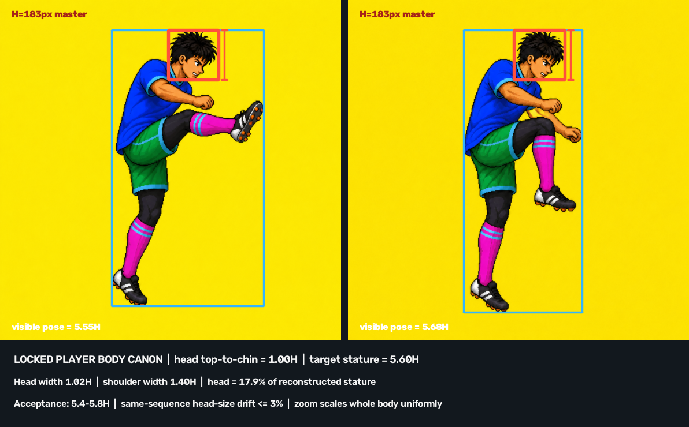

# 試合カットシーン 選手体型カノン

> 2026-08-19 ユーザー指定。試合パートの選手画像は、ポーズや画角が変わっても本書の体型・頭身から外さない。
> 参照画像の**体型だけ**を正典とし、ポーズ・衣装の黒タイツ・白いかかとは正典に含めない。

## 1. 正典



計測元は、ユーザーが「体型・等身が理想的」と指定した同一人物の2画像。元画像は各 `1254 × 1254px`。
両画像とも頭頂（髪を含む）から顎下までが **183px** で一致した。

### 基本単位

- `1H` = 頭頂（髪の最高点を含む）から顎下まで。
- 正典マスターでは `1H = 183px`。
- 頭幅 = `1.02H`（目安 `187px`）。
- 復元身長 = **`5.60H`**。許容範囲は `5.40–5.80H`。
- 頭の高さ = 復元身長の **17.9%**。許容範囲は `17.2–18.5%`。
- 肩幅 = `1.40H`。許容範囲は `1.32–1.48H`。

ここでいう復元身長は、屈曲したポーズの画像上の縦幅ではなく、頭・胴・大腿・下腿を骨格線に沿って伸ばした長さ。ジャンプ、ヘディング、オーバーヘッド等で画像の外接矩形が変わっても、頭身判定は復元身長で行う。

## 2. 同一シーケンスの固定条件

- 頭の高さのフレーム間差は **3%以内**。同一解像度へ正規化後は原則 `±2px` 以内。
- 頭幅 / 頭高は `0.97–1.07`。
- 顔、髪型、首の太さ、肩幅、胴の厚み、腰幅、手足の太さをフレーム間で変えない。
- カメラ倍率を変える場合、頭だけを縮小・拡大しない。人物全体を一様スケールする。
- 遠近で意図的に比率を変える演出は、連続する全フレームへ同じ透視条件を適用する。単独フレームだけの変形は禁止。
- ポーズ参照の忠実度を上げるために頭を小さくしない。関節位置と体型カノンは別々に固定する。

## 3. 生成プロンプトの固定句

新規生成・修正では、ポーズ指示とは別に次を必ず含める。

```text
Locked player-body canon: athletic stylized adult at exactly 5.6 heads tall.
The head from hair crown to chin is 17.9% of reconstructed standing stature.
Head width is 1.02 head-heights; shoulder width is 1.40 head-heights.
Never shrink the head to make the body look taller or more dynamic.
Preserve the same head size, face silhouette, neck thickness, shoulder width,
torso mass and limb thickness across every frame. Camera scaling must resize
the whole character uniformly.
```

参照画像を渡す時は役割を明示する。

- 体型参照: 本書の計測画像。
- ポーズ参照: 動画から直接抜いた対象フレームと骨格トレース。
- 画風参照: 採用済み試合素材。
- 体型参照のポーズや衣装をコピーしない。

## 4. 受入ゲート

1. 全フレームで頭頂・顎下・左右頭端を記録する。
2. 骨格線から復元身長を算出し、`5.40–5.80H` に収まることを確認する。
3. 同一シーケンスの頭高差が3%を超えたら不合格。
4. 頭幅 / 頭高、肩幅 / 頭高が許容域外なら不合格。
5. 機械計測後、別系レビューで「頭だけ小さい」「胴だけ長い」「脚だけ細長い」フレームを探索する。
6. ユーザー目視採用前にゲームへ統合しない。

## 5. 今回の2画像の実測

| 参照 | 頭高 | 頭幅 | ポーズ外接高 | 外接高 / H |
|---|---:|---:|---:|---:|
| 左 | 183px | 約185px | 1016px | 5.55H |
| 右 | 183px | 約187px | 1039px | 5.68H |

ポーズ外接高は姿勢依存の補助値。両画像で頭高が一致し、外接高差も2.3%に収まるため、同一体型カノンとして採用する。
